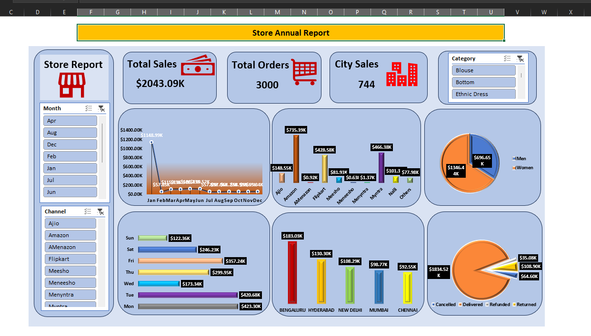

# store-annual-data-analysis-dashboard

# Store Sales Analysis Dashboard | Excel

## Project Overview
An interactive Store Sales Analysis Dashboard built using Microsoft Excel to analyze sales performance, order trends, customer segments, sales channels, categories, cities, and order status.

## Tools & Technologies
- Microsoft Excel
- Pivot Tables
- Pivot Charts
- Slicers
- Data Visualization
- Excel Formulas

## Key KPIs
- Total Sales: $2.04M
- Total Orders: 3,000
- City Sales Analysis
- Top 5 Cities by Sales

## Dashboard Analysis
The dashboard provides insights into:

- Monthly Sales Trend
- Daily Sales Trend
- Sales by Channel
- Sales by Category
- Sales by Gender
- Top 5 City Sales
- Sales by Order Status
- Total Sales and Order Performance

## Interactive Features
Interactive slicers were added for:
- Month
- Channel
- Category

These slicers allow users to dynamically filter the dashboard and analyze specific sales segments.

## Key Insights
- Identified monthly and daily sales patterns.
- Compared sales performance across different channels.
- Analyzed sales contribution by gender and category.
- Identified the Top 5 cities based on sales.
- Analyzed delivered, cancelled, refunded, and returned orders.

## Dashboard Preview

## 📂 Files
- `Satoredata.xlsx` – Raw sales data and Excel dashboard
- `storedashboard.png` – Dashboard screenshot

## 👤 Author
Rinku

